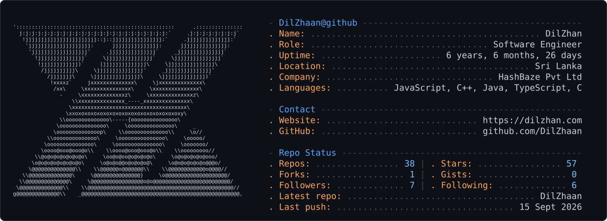

<picture>
  <source media="(prefers-color-scheme: dark)" srcset="./img/dark_mode.svg" />
  <source media="(prefers-color-scheme: light)" srcset="./img/light_mode.svg" />
  
</picture>

  
  
  
  
  
  

  

